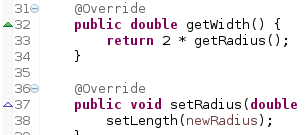
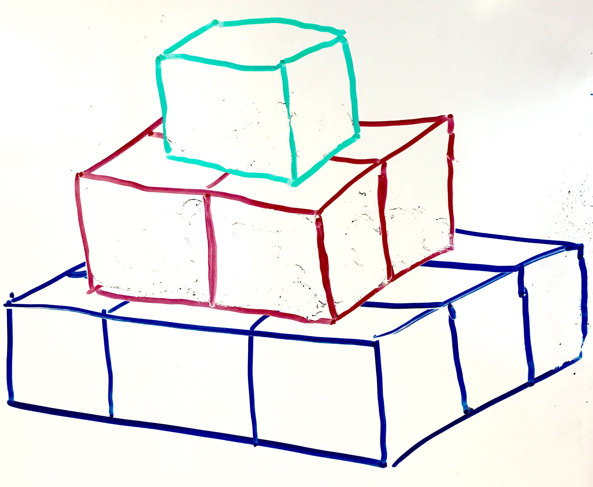

#### *NB: This repository has been cloned from a GitLab server that was used for assignment delivery*
#### *This repository does not contain the textual answers, and may or may not be fully completed in some parts*

# Lab 6 - Forkrav og datainvariant – arv og substitusjonsprinsippet – litt rekursjon

## Læringsmål

Når du er ferdig med oppgaven, skal du kunne:

 * Implementere sjekk av forkrav og datainvariant (Del 1)
 * Gjøre rede for hva forkrav er og gi eksempel på bruk (Del 1)
 * Gi eksempel på datainvariant (Del 1)
 * Gjøre enkel gjenbruk av kode med arv (Del 2)
 * Gi eksempel på problemer som kan oppstå ved bruk av arv (Del 2)
 * Løse enkle problemer ved bruk av rekursjon (Del 3)
 * Gjøre rede for hvordan merge sort fungerer (Del 3)

Det er ganske mye å gjøre, så du blir gjerne ikke ferdig på én uke. Del 1 og del 2 er viktigst.

## Innhold

Prosjektet inneholder følgende Java-pakker:

* [inf101.v17.lab6.recursion] – her skal oppgavene om rekursjon løses.
* [inf101.v17.lab6.recursion.tests] – pakke for diverse tester av rekursjonsoppgavene
* [inf101.v17.lab6.shapes] – grensesnitt, implementasjoner og tester for geometriske figurer (linje, sirkel, rektangel), til bruk i oppgavene om arv


# Del 1: Forkrav og invarianter

## Linjer, sirkler og rektangler – Et bibliotek for Shapes

### Pakker

I resten av labben skal vi bruke følgende pakker:

* [inf101.v17.lab6.shapes] – grensesnitt for geometriske figurer (linje, sirkel, rektangel)
* [inf101.v17.lab6.shapes.a] – klasser med implementasjoner av geometriske figurer
* [inf101.v17.lab6.shapes.b] – tomme klasser for en alternativ implementasjon av figurer
* [inf101.v17.lab6.shapes.c] – tomme klasser for en alternativ implementasjon av figurer
* [inf101.v17.lab6.shapes.tests] – pakke for diverse tester av innholdet i de andre pakkene
* [inf101.v17.util] – inneholder klasser og grensesnitt for datagenerering (videreutvikling av [Lab 4](lab-4))
* [inf101.v17.util.generators] – klasser for generering av spesifikke typer data (videreutvikling av [Lab 4](lab-4))

### Grensesnitt
De interessante grensesnittene er:

* [IShape] – en figur med udefinert form, men med areal og omkrets, og en ide om bredde og høyde  
* [ILine] – utvidelse av `IShape` for å representere linjer som har en lengde  
* [ICircle] – utvidelse av `IShape` for å representere sirkler med radius  
* [IRectangle] – utvidelse av `IShape` for å representere rektangler med bredde og høyde  
* [IShapeFactory] – et [factory](https://en.wikipedia.org/wiki/Factory_(object-oriented_programming)) som brukes for å kunne   lage figurer (av en kjent type) uten at man trenger å vite hvilken klasse de er av (vi trenger dette for å kunne håndtere   eksperimenter med flere forskjellige måter å implementere figurene på)  


### Flere varianter

I løpet av oppgaven skal du implementere figurene på flere forskjellige måter (A, B og C variantene). A-varianten følger med, men den har noen svakheter. I tillegg til at variantene ligger i hver sin pakke, er variant-bokstaven også med i klassenavnet. (Pass på at det ikke går surr i ting når du har mange filer oppe i Eclipse samtidig!)

### Tester

Testene er delt i to pakker, [inf101.v17.lab6.shapes.tests.properties], som inneholder tester og egenskaper som er felles for alle implementasjoner av samme grensesnitt, og [inf101.v17.lab6.shapes.tests] som inneholder de kjørbare testene.

For å kjøre alle testene på koden som følger med, kjør `ATests`. Når du har laget B- og C-variantene kan du også prøve `BTests` og `CTests`. I tillegg vil `AllTests` kjøre alle testene for alle variantene.

# Oppgave 1: Små eksperimenter med Shapes

* Kjør alle testene for A-varianten (ligger i `ATests.java`). Legg merke til at noen av dem feiler (foreløpig).

* Lag et program (f.eks. `ShapeMain`) med en main-metode som oppretter noen forskjellige figurer og skriver ut informasjon om dem. F.eks.:

```
Circle has radius=3.14, area=30.97, circumference=19.73
Circle's sizebox has width=6.28, height=6.28, area=39.44, circumference=25.12
```

# Oppgave 2: Forkrav og klasseinvarianter (Variant A)

Vi skal nå lage figur-implementasjonene våre litt mer robuste, slik at vi oppdager feil så fort som mulig. 

En del metoder har *[forkrav](arv-forkrav-invariant-substitusjonsprinsippet#forkrav)* som må være oppfylt. F.eks. må alle størrelsene være ikke-negative tall, slik at vi ikke får f.eks. en sirkel med radius -3.

I tillegg har hver klasse en *[datainvariant](arv-forkrav-invariant-substitusjonsprinsippet#klasseinvariant-eller-datainvariant)* (eller *klasseinvariant*), som forteller hvilke verdier feltvariablene har lov til å ha.  F.eks., selv om Java lar deg putte et negativt tall inn i `width` feltet i `RectangleA` vil vi ikke at rektangle-objekter skal kunne ha negative størrelser.

For denne deloppgaven kan du bruke `RectangleA` som eksempel – den sjekker både forkrav og datainvariant.

* Skriv en metode `public static void checkState` for hver av klassene `CircleA` og `LineA`. Den skal ta imot et argument av samme klassen, og sjekke at feltvariablene ikke har ulovlige verdier. Hvis du oppdager en ulovlig verdi, skal du kaste `IllegalStateException` med en passende melding. (Det er viktig at denne metoden er `static` – av litt kompliserte grunner relatert til arv og overstyring, som vi skal komme tilbake til senere.) 

* Legg inn et kall til `checkState(this)` på slutten av alle metoder (i de tre klassene) som endrer objektet – inkludert konstruktøren.

* Kjør testene på nytt, og se at du nå får feil med `IllegalStateException` på noen av testene.

* Legg så til en sjekk av argumentene på alle metodene som har forkrav (inkl konstruktørene). I dette tilfellet er må vi sjekke argumentene før vi lagrer dem til feltvariablene, slik at vi ikke ender opp med å bryte klasseinvarianten (generelt må vi vurdere alle parameterne til alle metodene, og se om det skal være begrensinger på noen av dem). Du skal kaste `IllegalArgumentException` (med en passende melding), hvis du oppdager et ugyldig argument.

* Kjør testene på nytt, de skal nå ikke feile. Hvis du får feil i `testIllegalArgs` eller `testInvariants2` har du ikke sjekket argumentene godt nok.

Hvis du leser nøye gjennom klassene `RectangleA`, `CircleA` og `LineA` bør du nå kunne overbevise deg selv om at `checkState` aldri kan feile. For at dette resonnementet skal være sant, må feltvariablene være `private` – ellers kan det skje endringer andre steder enn i metodene du nettopp har sjekket og som nå nøye sjekker hvilke verdier som skrives til feltvariablene. Dette er en av fordelene med "innkapsling" – du vet at all koden som kan berøre feltvariablene dine er på ett sted.

I dette tilfellet vil det altså være overflødig å kalle `checkState` – vi vet at den aldri vil kaste `IllegalStateException` (med mindre det er noe veldig galt med Java når programmet kjøres). Ofte vil det være mye vanskeligere å være sikker på dette, og da kan en slik ekstra sjekk være nyttig for at man skal oppdage (og kunne fikse) feil så tidlig som mulig. I enkelte tilfeller vil det ikke være spesielt enkelt å sjekke tilstanden til et objekt (dvs. at klasseinvarianten er oppfylt) – da må man være ekstra forsiktig når man programmerer.

# Oppgave 3: Bli kjent med testene

Testene til denne delen av labben er satt opp på en interessant (og kanskje forvirrende) måte:

* Testene baserer seg (som vi har sett før, bla i [Lab 4](lab-4)) på *egenskaper* (f.eks. at bredden og høyden til en sirkel skal være lik 2*radius) og på testing med store mengder tilfeldige genererte objekter.

* Vi bruker generatorer (i pakken `inf101.v17.util.generators`) til å generere testdata.

* Testene bruker arv, slik at `RectangleATest extends AbstractRectangleTest extends AbstractShapeTest<IRectangle>` – tester som er felles for noen eller alle shapes er plassert i superklassene.

* Testene bruker også JUnits "test suites", dvs. at en test er bygget på andre tester. Du ser f.eks. dette i ATests – den inkluderer alle testene for rektangler, sirkler og linjer:
```
@SuiteClasses({ //
RectangleATest.class, //
		LineATest.class, //
		CircleATest.class, //
})
```
Tilsvarende samler `AllTests` testene fra `ATests`, `BTests` og `CTests`.

* *Oppgave:* Kjør testene i *ATests*. Kikk på testene som feiler og finn ut hvor de er implementert. Finn også koden for `testWidth`, `testRectArea` og `equalsTest` (følg sistnevnte inn i `StandardProperties` og ta en titt på testene for `equals` – du vil se at de tilsvarer definisjonen av [matematisk ekvivalens](https://en.wikipedia.org/wiki/Equivalence_relation)). Feil i `equalsTest` vil ofte komme av at du mangler `equals()` og `hashCode()` – disse genererer du fra *Source*-menyen i Eclipse.


* *Tips:*
   * *AssertionError:* en test har feilet (f.eks. ved ting ikke var like i `assertEquals`). Les feilmeldingen, og se om den gir et hint – ofte vil den si at vi forventet *a* men fant *b*.
   * *Andre exceptions:* Et unntak har blitt kastet mens testen ble kjørt. Sjekk hva unntaket er og hva feilmeldingen er (om noen)
   * I begge tilfeller er det viktig å følge sporene med hvilke kall som har blitt gjort før feilen oppstod. I Eclipse kan du dobbeltklikke på elementene i failure trace for å bli tatt direkte til koden i editoren (det kan du også gjøre hvis når du får melding om et unntak i konsollet under vanlig kjøring).
   * Å finne feil er en vitig programmeringsferdighet – pass på at du leser alle feilmeldingene, sjekker trace, og prøver å spore opp hvorfor noe har gått kalt – ofte er det mer enn nok hint til å finne ut av det ganske lett. For litt vanskeligere problemer kan det lønne seg å sette inn `System.out.println()` i koden her og der så du kan se på verdiene under kjøring, eller bruke debuggeren. 


# Del 2: Arv og substitusjonsprinsippet

# Oppgave 4: Kodegjenbruk med arv (Variant B)

Vi skal nå prøve å gjenbruke litt kode ved hjelp av arv. En del ting er likt mellom de forskjellige figurene: f.eks. kan vi ta utgangspunkt i at lengden i ILine svarer til bredden i IRectangle og radiusen i ICircle. IRectangle og ICircle er på en måte litt mer kompliserte figurer enn en linje – kanskje vi kan lage dem ved å ta utgangspunkt i linje-klassen?

* Du må fylle inn koden for B-varianten (LineB, RectangleB, CircleB, FactoryB, osv). Du kan enten kopiere koden fra A-varianten med en gang, og så endre den etterpå, eller du kan kopiere relevante metoder underveis.

* Lag RectangleB slik at den `extends LineB`, og  legger til  en feltvariabel for høyde. Bruk LineB's lengde som bredde (dvs. at `setWidth(w)` kaller `setLength(w)` – ikke legg til et eget bredde-felt).

* Du må så sørge for at utregning av areal og omkrets for rektangler blir riktig. Du kan bruke felles kode for dette, hvis du f.eks. i `LineB` bruker:

```
@Override
public double getCircumference() {
	return 2 * getWidth() + 2 * getHeight();
}
```

Dette vil virke fint også for linjer, for der vil `getHeight()` returnere 0. Siden RectangleB arver fra LineB, trenger du ikke implementere disse metodene der. RectangleB skal bare inneholde metodene som er spesifikke for rektangler: `getHeight`, `setHeight`, `setWidth` og konstruktøren.

* Lag så CircleB slik at den også `extends LineB`. Her trenger du ingen ekstra feltvariabler hvis du bruker lengden som radius (dvs. at `setRadius(r) kaller setLength(r)`). Areal og omkrets for sirkel er annerledes enn for rektangler og linjer, så her må du overstyre LineB sin implementasjon i CircleB. Husk også at bredden og høyden på en sirkel er 2*radius – du må overstyre disse metodene også.

* Pass på å legge til `@Override` foran de metodene som overstyrer en metode fra superklassen eller implementerer en metode fra et grensesnitt. Se ut i margen i Eclipse – der vil du se en grønn trekant for metodene som overstyrer superklassen og en tom trekant for metodene som er implementasjoner av et grensesnitt. Hvis du trykker på trekanten blir du flyttet til superklassen/grensesnittet.

* Pass på å lage toString, hashCode og equals for alle klassene, ellers vil testene feile (*Source → Generate hashCode() and equals()* og *Source → Generate toString()*).



* Fyll ut `FactoryB` – hver av metodene skal returnere et nytt objekt av den passende klassen fra B-varianten. (Du kan evt. kopiere koden fra FactoryA, og endre A til B). Testene bruker denne "fabrikken" til å lage objekter av den ønskede varianten, uten av vi må spesifikt bruke klassenavnene der (RectangleA vs RectangleB). 

* Se på koden til `RectangleATest`, `RectangleBTest` og `AbstractRectangleTest`. Den samme koden blir brukt for å teste alle variantene – den eneste forskjellen er hvilken "fabrikk" som produserer objektene – dette styrer hvilken variant som brukes. Dette er samme [Factory Pattern](https://en.wikipedia.org/wiki/Factory_(object-oriented_programming)) som vi så et hint av i [Semesteroppgave 1](sem-1).

* Kjør alle B-testene med `BTests`. Sjekk at alt virker.

# Oppgave 5: Substitusjonsprinsippet

[Liskovs substitusjonsprinsipp](arv-forkrav-invariant-substitusjonsprinsippet#liskovs-substitusjonsprinsipp) ([Wikipedia](https://en.wikipedia.org/wiki/Liskov_substitution_principle)) sier kort fortalt at alt som er sant for superklassen, også må være sant for subklassene.

I Oppgave 4 ordnet vi arvingen slik:

```
RectangleB extends LineB
CircleB extends LineB
```

Dvs. at alt som er sant om LineB også må være sant om RectangleB og CircleB – disse må kunne oppføre seg som linjer. I testene vi gjorde over, testet vi at RectangleB oppførte seg som IRectangle og CircleB oppførte seg som CircleA.

Vi skal nå sjekke om RectangleB og CircleB også oppfører seg some ILine, i tråd med substitusjonsprinsippet. Da må vi kjøre testene for linjer på koden for rektangler og sirkler. Dette fikser vi lett ved å justere hvordan FactoryB produserer ILine-objekter.

* Pass først på at alle testene fra oppgave 4 passerer, ellers blir det rot.

* Endre FactoryB slik at `line(length)`-metoden returnere `new RectangleB(length, 0.0)`. Kjør BTests en gang til. Virker testene?

* Prøv også med f.eks. `new RectangleB(length, length)`. Virker testene fremdeles?

* Prøv så med `new CircleB(length)`. Virker testene nå?

* Basert på hva du fant ut over, virker det som en lur ide å basere RectangleB og CircleB på LineB? Kan du se for deg en måte å lage CircleB på med arv fra LineB, slik at den tilfredstiller subsitusjonsprinsippet og alle testene passerer?

# Oppgave 6: Alternativ arv (Variant C)
La oss prøve en annen måte å organisere arven på. Over tenkte vi på rektangler som en utvidelse av linjer. Hva om vi ser på linjer som et spesialtilfelle av rektangler?

Lag en ny variant i pakken inf101.v17.lab6.shapes.c:

* `CircleC` blir selvstendig, uten arv – samme kode som i `CircleA`.

* For LineC og RectangleC kan du klippe og lime metoder fra LineB og RectangleB:

* La LineC arve fra RectangleC: `LineC extends RectangleC`. Koden for areal, omkrets, sizebox og slikt plasseres i RectangleC. Konstruktøren i LineC kan så kalle `super(length, 0.0)`, slik at en linje blir et rektangel med høyde 0.

* Implementer `getSizeBox` i RectangleC med f.eks. `return this;`.

* LineC trenger nå bare konstruktør, og en implementasjon av `setLength` som kaller `setWidth`.

* Pass på å lage hashCode og equals for RectangleC, ellers vil testene feile. LineC klarer seg fint med de den arver fra RectangleC.

* Lag FactoryC slik at `rectangle()` returnerer en  RectangleC, `line()`returnerer en LineC, osv.

* Kjør testene i CTests, og fiks eventuelle feil du finner.

* Sammenlikn koden for LineA, LineB, LineC, RectangleA, RectangleB og RectangleC. Hvilken løsning ser best / enklest ut?

Vi er nå i den situasjonen at en linje også er et rektangel. Dvs. at etter at du har opprettet en linje, kan du (hvis du vet at det er en LineC), kalle setHeight på den – noe som strengt tatt ikke er del av vanlig oppførsel for linjer. La oss prøve dette.

* Gå inn i FactoryC, og endre `line()` til:

```
@Override
public ILine line(double length) {
	LineC l = new LineC(length);
	l.setHeight(length);
	return l;
}
```

* Kjør testene. Virker alt fremdeles?

Vi har (tilfeldigvis?) gjort det slik at testene for linjer bruker rektangel-formelen for areal og omkrets. Derfor virker testene selv om vi nå har en linje som har en høyde forskjellig fra null. Dette er OK – men la oss prøve å være strenge på oppførselen til LineC.

### LineC med datainvariant

* Legg til en datainvariant-sjekk i LineC, som sjekker at getHeight() != 0:

```
public static void checkState(LineC line) {
	if (line.getHeight() != 0.0) {
		throw new IllegalStateException("Height must be zero " + line.toString());
	}
}
```

* Legg inn et kall til `checkState(this)` i `setLength()`. 

* Kjør CTests. Hva skjer?

Nå prøvde vi å legge begrensninger på subklassen som ikke fantes i superklassen (at høyden skal være 0). Superklassen vet ikke om disse begrensingene, og lar brukeren sette høyden forskjellig fra 0 likevel. I praksis har `setHeight` metoden fått et forkrav (newHeight == 0) som er strengere enn hva det var i superklassen, i strid med substitusjonsprinsippet. Slike problemer kan være vanskelige å oppdage – det er ganske heldig at testene avdekket det.

### Strengere tester

* Fjern checkState-sjekken.

* Gå inn i [AbstractLineTest.java], og endre f.eks. `areaProperty` og `circumferenceProperty` slik at de krever at høyden er 0.

* Kjør testene på nytt, både BTests og CTests. Hvordan går det?

Problemene med linje-som-rektangel eller rektangel-som-linje oppstår fordi IShape har metoder for todimensjonale figurer som strengt tatt ikke gir mening for endimensjonale figurer slik som linjer. Hvis vi lager tester for disse som låser meningen til noe spesifikt (slik som at overflaten til en linje er 0), så får vi problemer med å bruke rektangler som representasjon for linjer. Samme problemet får vi hvis vi f.eks. lager en tredimensjonal Box som arver fra Rectangle, og lar getArea() returnere overflaten til boksen, eller hvis vi begynner å regne ut bredde og høyde av roterte figurer.

## Konklusjon

Litt avhengig av hvordan vi vil at oppførselen til linjer skal være, er det dessverre slik at arv kan ha uforutsette konsekvenser. Likevel, det er mange tilfeller hvor det passer veldig bra – slik vi så i Lab 5, og skal se flere eksempler på i neste semesteroppgave.


# Del 3: Rekursjon

# Oppgave 7: Grunnleggende rekursjon

I denne oppgaven skal vi skrive ferdig de rekursive funksjonene i [Basic] -klassen. Etter at vi er ferdig med alle deloppgavene skal alle testene i [TestBasic] passere. Merk at testene vi finner her er små og ufullstendinge, og vi vil kjøre mer omfattende tester på koden du leverer inn. Det er derfor svært lurt å skrive sine egne tester i tillegg for å teste flere scenarioer.

I de rekursive oppgavene i denne bolken skal du ikke benytte løkker av noe slag (for, while etc.). 

## Oppgave 7a
 * Fullfør funksjonen `sumOfDigits(int num)` som regner ut summen av alle sifrene i nummeret som blir gitt.

## Oppgave 7b
 * Fullfør funksjonen `pyramidBlocks(int height)` som teller antall byggeklosser i en pyramide. På bildet under vises en pyramide med høyde 3, som inneholder 14 byggeklosser.



## Oppgave 7c
 * Fullfør funksjonen `nCr(int n, int r)` som teller antall måter man kan kombinere r elementer fra en gruppe på n elementer. For eksempel vil dette telle antall måter man kan velge et elevråd bestående av r medlemmer i en klasse med n elever.

Dersom du tester oppgave 7c og finner ut at det går forferdelig tregt selv for tilsynelatende moderate verdier av n og r, ikke bli overrasket. Den rekursive løsningen på dette problemet bruker laaang tid. (Hvorfor er det slik?)


# Oppgave 8: Merge sort
I denne oppgaven skal vi jobbe med klassen [Sorting]. Fra forelesning om rekursjon husker dere kanskje hvordan merge sort fungerer: Vi begynner først med å dele arbeidsmengden vår i to, og deretter rekursivt sorterer vi hver halvdel. Etter at de to halvdelene begge er sortert, fletter vi de to listene sammen ved hjelp av tre pekere: Én for hvor langt vi er kommet i den venstre listen, én for hvor langt vi er kommet i den høyre listen og én for hvor langt vi er kommet totalt i den nye, sorterte listen. Det kan være lurt å ta en titt på [Wikipedia-siden om merge sort]. Se ogås gjerne på  koden for [mergesort fra forelesningen] og en annen, liknende [implementasjon fra i fjor]

Den merge sort vi gjorde på forelesning sorterer heltall veldig bra. Men som gode programmerere ønsker vi at koden vår skal kunne gjenbrukes så mye som mulig og være så generell som mulig. Vi ønsker derfor å skrive merge sort på nytt slik at den nå sorterer en list med hvilke som helst type sammenlignbare elementer. For å få det til trenger vi å gjøre noen ting annerledes:

* Vi må bruke generiske typer, og i Java går de dårlig sammen med []-arrays. Da er det bedre å bruke List og ArrayList.
* Hvis vi antar at vi har lister av typen `List<T>` så vet vi at elementene kan være av enhver type `T`. Det hjelper oss ikke så mye når vi skal sortere – da er vi jo avhengig av at man kan *sammenlikne* elementene, så man kan finne ut om ett element skal være foran et annet, osv. Vi må altså uttrykke at *T* skal være en type som er *sammenliknbar*. I Java har vi et grensesnitt for sammenlikning: `Comparable<T>` – hvis noe implementerer `Comparable<T>`, så ved vi at objektene kan sammenliknes (med `compareTo`-metoden) med andre `T`-er. Du spesifiserer dette når du deklarerer typeparameteret `T`: `<T extends Comparable<T>>`.

* `Comparable<T>`-grensesnittet definerer en metoden `int compareTo(T other)`, som returnerer et heltall som er:
    * *< 0* om `this` er  mindre enn `other`,
    * *== 0* hvis `this` er lik `other`
    * *> 0* hvis `this` er  mindre enn `other`

Fra før er dette gjort med selection sort. Forsøk å gjøre det samme med merge sort. Merk at å kopiere kode direkte fra forelesningen (enten v17 eller v16) er et bar utgangspunkt – man lærer dog mye bedre om man forsøker å gjenskape algoritmen på egen hånd.

 * Skriv `public static <T extends Comparable<T>> void mergeSort(List<T> lst)` som virker for enhver liste av sammenlignbare (Comparable) elementer


I [TestSorting] er det noen tester som er klare for å teste selection sort og merge sort. Ta en titt på hvordan testene er laget – det er to varianter som begge tester med tilfeldige lister: den ene lager en kopi av listen, sorterer den med Javas innebygde sortering, og så sammenlikner med vår egen sortertingsalgoritme, og den andre sorterer listen og så sjekker at elementene ligger i sortert rekkefølge. Sistnevne er kanskje den smarteste måten å teste på – siden det er mye enklere å sjekke om noe er sortert enn det er å sortere det. 

Etter at du er ferdig med oppgave 8 skal alle testene i [TestSorting] passere. Dersom alt er som det skal, vil merge sort være langt raskere enn selection sort for store verdier av `LISTLEN`. (Hvorfor er det slik?)
